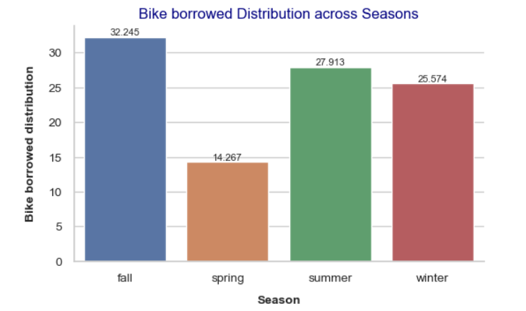
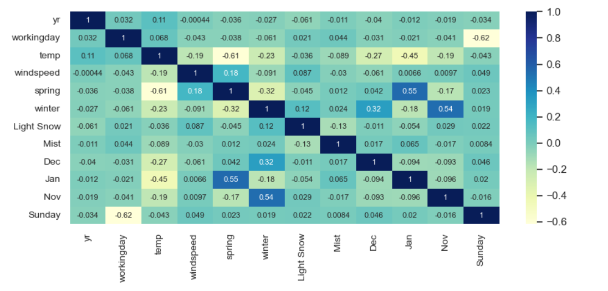
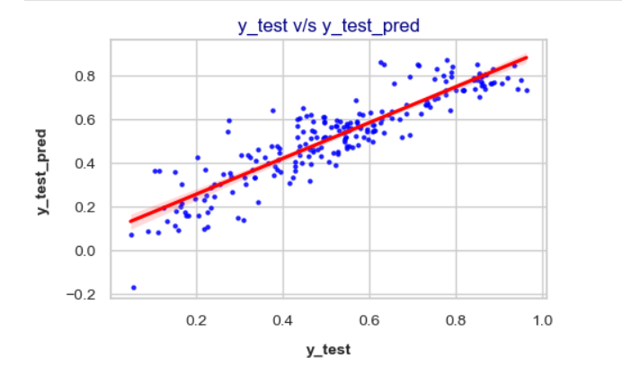
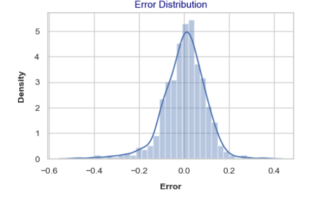

# Urban Mobility Demand Forecasting using Multiple Linear Regression


---

## Project Overview

Shared-bike operators must balance fleet availability with operational efficiency. Underestimating demand can lead to service shortages and poor customer experience, while overestimating demand results in underutilized assets and increased operational costs.

This project develops a **Multiple Linear Regression** model to estimate daily bike rental demand using environmental, seasonal, and temporal factors. In addition to demand prediction, the analysis focuses on understanding the key drivers influencing bike-sharing usage.

---

## Business Problem

A bike-sharing company seeks to understand which factors significantly influence daily rental demand and whether demand can be reliably estimated using available weather and calendar-related information.

The objective is to build an interpretable statistical model that can:

- Quantify the impact of environmental conditions on demand.
- Identify the most influential demand drivers.
- Support operational planning and resource allocation.
- Provide insights for demand-aware decision making.

---

## Dataset Description

The dataset contains daily bike-sharing demand records along with weather, seasonal, and calendar-related attributes.

### Target Variable

| Variable | Description |
|---|---|
| `cnt` | Total daily bike rentals |

### Key Predictor Variables

| Variable | Description |
|---|---|
| `temp` | Normalized temperature |
| `windspeed` | Normalized wind speed |
| `season` | Season of the year |
| `weathersit` | Weather condition |
| `yr` | Year indicator |
| `mnth` | Month |
| `workingday` | Working day flag |
| `holiday` | Holiday flag |

---

## Project Objectives

1. Understand the factors influencing bike-sharing demand.
2. Perform exploratory data analysis to identify demand patterns.
3. Build an interpretable **Multiple Linear Regression** model.
4. Validate key regression assumptions.
5. Evaluate model performance on unseen data.
6. Translate analytical findings into operational insights.

---

## Methodology

### Data Preparation

- Removed identifier and leakage-related variables.
- Converted categorical variables using dummy encoding.
- Split data into training and testing datasets.
- Applied Min-Max scaling to numerical variables.

### Exploratory Data Analysis

The following analyses were performed:

- Seasonal demand analysis
- Weather impact assessment
- Monthly demand trends
- Working day and holiday analysis
- Correlation analysis among numerical variables

The analysis identified several environmental and seasonal factors that influence bike rental demand.

### Seasonal Demand Pattern

The visualization below shows how bike demand varies across different seasons.



**Observation:** Bike demand is highest during Fall and Summer, while Spring exhibits relatively lower rental activity, indicating a strong seasonal influence on shared-bike usage.

---

### Correlation Analysis

The correlation heatmap highlights the relationships between numerical variables and bike demand.



**Observation:** Temperature exhibits the strongest positive correlation with bike demand. The heatmap also reveals potential multicollinearity among certain predictor variables, which was further evaluated using VIF during model development.

### Feature Selection

Feature selection was performed using a combination of:

- Recursive Feature Elimination (RFE)
- Statistical significance using p-values
- Variance Inflation Factor (VIF)

The objective was to retain statistically significant predictors while minimizing multicollinearity.

### Model Development

A **Multiple Linear Regression** model was developed using StatsModels and iteratively refined through feature elimination and multicollinearity assessment.

---

## Final Model Performance

### Training Dataset

| Metric | Value |
|---|---:|
| R² | 0.824 |
| Adjusted R² | 0.821 |
| RMSE | 0.094 |

### Test Dataset

| Metric | Value |
|---|---:|
| R² | 0.812 |
| Adjusted R² | 0.803 |
| RMSE | 0.095 |

### Performance Interpretation

The close alignment between training and test performance indicates that the model generalizes well and shows limited evidence of overfitting.

### Actual vs Predicted Demand

The plot below compares actual demand values against model predictions.



**Observation:** Predicted values closely follow actual demand patterns, demonstrating the model's ability to generalize effectively to unseen data.

---

## Final Model Features

| Feature | Coefficient | Interpretation |
|---|---:|---|
| `temp` | +0.37 | Strong positive influence on demand |
| `yr` | +0.24 | Captures year-over-year demand growth |
| `winter` | +0.07 | Positive seasonal effect |
| `windspeed` | -0.16 | Higher wind speed reduces demand |
| `spring` | -0.11 | Lower demand compared to baseline season |
| `Light Snow` | -0.29 | Strong negative impact due to adverse weather |
| `Mist` | -0.07 | Negative impact due to reduced weather favorability |
| `Dec` | -0.06 | Lower demand in December |
| `Jan` | -0.06 | Lower demand in January |
| `Nov` | -0.07 | Lower demand in November |

---

## Key Insights

### Positive Demand Drivers

- **Temperature** emerged as the strongest positive predictor of bike demand.
- **Year (`yr`)** indicates significant growth in bike-sharing adoption between 2018 and 2019.
- **Winter season** showed a positive contribution after controlling for other variables.

### Negative Demand Drivers

- **Light Snow** had the strongest negative impact on bike rentals.
- **High wind speed** reduced bike usage.
- **Misty weather conditions** were associated with lower demand.
- **November, December, and January** exhibited reduced demand relative to the baseline period.

---

## Statistical Validation

### Multicollinearity Assessment

The highest Variance Inflation Factor values observed in the final model were:

| Feature | VIF |
|---|---:|
| `windspeed` | 3.96 |
| `temp` | 3.58 |
| `winter` | 2.50 |
| `spring` | 2.34 |
| `yr` | 2.06 |

All VIF values remained below commonly accepted thresholds, indicating no significant multicollinearity concerns in the final model.

### Residual Analysis

The final model satisfied the key assumptions of linear regression:

- Residuals were approximately normally distributed.
- No major heteroscedasticity was observed.
- Train and test performance remained closely aligned.

### Residual Distribution

Residual analysis was performed to validate the assumptions of linear regression.



**Observation:** Residuals are approximately normally distributed and do not exhibit major deviations from expected behavior, supporting the validity of the regression model.

---

## Business Recommendations

1. **Use temperature as a primary demand indicator**  
   Temperature was the strongest positive predictor, so demand planning should closely track seasonal and daily temperature patterns.

2. **Plan for continued adoption growth**  
   The positive coefficient of `yr` suggests increased bike-sharing adoption from 2018 to 2019. Capacity planning should account for this growth trend.

3. **Adjust operations during adverse weather**  
   Light Snow and Mist negatively impacted demand. These conditions can be used as early indicators for reduced fleet requirement.

4. **Account for seasonal and monthly variation**  
   Spring, January, November, and December showed lower demand patterns, which can support maintenance scheduling and operational planning.

---

## Limitations

- This project focuses exclusively on **Multiple Linear Regression**.
- Model comparison with Ridge, Lasso, Random Forest, and Gradient Boosting algorithms was outside the scope of this study.
- Historical lag-based demand features were not incorporated; therefore, this solution should be interpreted as a regression model rather than a full time-series forecasting model.
- External factors such as local events, pricing changes, promotions, and station-level availability were not included.

---

## Future Enhancements

Potential extensions include:

- Evaluate regularized regression techniques such as **Ridge** and **Lasso Regression**.
- Compare performance against tree-based ensemble models such as **Random Forest** and **Gradient Boosting**.
- Add lag-based demand features to extend the analysis toward time-series forecasting.
- Integrate real-time weather feeds for operational prediction.
- Implement model monitoring and retraining pipelines to handle changing demand patterns.

---

## Technologies Used

- Python
- Pandas
- NumPy
- Matplotlib
- Seaborn
- Scikit-Learn
- StatsModels
- Jupyter Notebook

---

## Repository Structure

```text
urban-mobility-demand-forecasting/
│
├── README.md
├── requirements.txt
│
├── data/
│   └── day.csv
│
├── notebooks/
│   └── urban_mobility_demand_forecasting.ipynb
│
└── reports/
    └── figures/
```

---

## How to Run

1. Clone the repository:

```bash
git clone https://github.com/rajani2024/urban-mobility-demand-forecasting.git
```

2. Navigate to the project folder:

```bash
cd urban-mobility-demand-forecasting
```

3. Install dependencies:

```bash
pip install -r requirements.txt
```

4. Open the notebook:

```bash
jupyter notebook notebooks/urban_mobility_demand_forecasting.ipynb
```